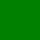
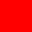

# SVG XInclude refusal (TDD 2.23c)

Every image below except the first uses XInclude (harmlessly: it includes a red
square from a `data:` URI). On Linux and Windows each shows the broken-image
placeholder; on macOS each shows a red square.

Plain SVG, always shown (a green square):

Namespace under the prefix `q`:

Namespace spelled with a character reference:

UTF-16 with a byte-order mark:

Gzip-compressed `.svgz`:

An SVG embedding the prefixed one as a base64 `data:` image:

